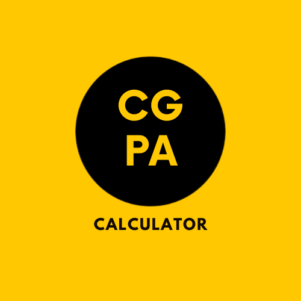

<!-- Improved compatibility of back to top link: See: https://github.com/despondentG/CGPA-Calculator/pull/73 -->

<!--
*** Thanks for checking out the Best-README-Template. If you have a suggestion
*** that would make this better, please fork the repo and create a pull request
*** or simply open an issue with the tag "enhancement".
*** Don't forget to give the project a star!
*** Thanks again! Now go create something AMAZING! :D
-->

<!-- PROJECT SHIELDS -->
<!--
*** I'm using markdown "reference style" links for readability.
*** Reference links are enclosed in brackets [ ] instead of parentheses ( ).
*** See the bottom of this document for the declaration of the reference variables
*** for contributors-url, forks-url, etc. This is an optional, concise syntax you may use.
*** https://www.markdownguide.org/basic-syntax/#reference-style-links
-->
[![Contributors][contributors-shield]][contributors-url]
[![Forks][forks-shield]][forks-url]
[![Stargazers][stars-shield]][stars-url]
[![Issues][issues-shield]][issues-url]
[![MIT License][license-shield]][license-url]
[![LinkedIn][linkedin-shield]][linkedin-url]

<!-- PROJECT LOGO -->
 

  

  <h3 align="center">CGPA Calculator</h3>

  

    Simplifying GPA Management with Kotlin!
     
      <a href="https://github.com/despondentG/CGPA-Calculator"><strong>Explore the docs »</strong></a>
     
     
  

<!-- TABLE OF CONTENTS -->

  
Table of Contents

  <ol>
    <li>
      <a href="#about-the-project">About The Project</a>
      <ul>
        <li><a href="#built-with">Built With</a></li>
      </ul>
    </li>
    <li>
      <a href="#getting-started">Getting Started</a>
      <ul>
        <li><a href="#prerequisites">Prerequisites</a></li>
        <li><a href="#installation">Installation</a></li>
      </ul>
    </li>
    <li><a href="#usage">Usage</a></li>
    <li><a href="#usage">Example Workflow</a></li>
    <li><a href="#roadmap">Roadmap</a></li>
    <li><a href="#contributing">Contributing</a></li>
    <li><a href="#license">License</a></li>
    <li><a href="#contact">Contact</a></li>
    <li><a href="#acknowledgments">Acknowledgments</a></li>
  </ol>

<!-- ABOUT THE PROJECT -->
## About The Project

[![Product Name Screen Shot][product-screenshot]](https://example.com)

The CGPA Calculator is a simple yet powerful tool designed to help students quickly calculate their Cumulative Grade Point Average (CGPA). Built using Kotlin, this app offers a user-friendly interface that allows users to input their course credits and grades effortlessly.
Key Features:

* Easy Input: Enter course credits and corresponding grades seamlessly.
* Accurate Calculation: Automatically computes CGPA based on entered data.
* Reset: Reset the values to calculate multiple times without having to restart the application.

This project was created to provide students with a convenient way to track their academic progress and make informed decisions regarding their studies. Whether you're a high school student, undergraduate, or graduate student, the CGPA Calculator aims to simplify the process of GPA calculation.

(<a href="#readme-top">back to top</a>)

### Built With

This section should list any major frameworks/libraries used to bootstrap your project. Leave any add-ons/plugins for the acknowledgements section. Here are a few examples.

* [![Kotlin][Next.js]][Next-url]

(<a href="#readme-top">back to top</a>)

<!-- GETTING STARTED -->
## Getting Started

To get a local copy up and running follow these simple example steps.

### Prerequisites

Enabling Allow Unknown Sources on Android Devices:

  * Navigate to Settings: Open the Settings app on your Android device.
  * Access Security Settings: Look for and tap on "Security" or "Security & privacy," depending on your device.
  * Find Unknown Sources Option: Scroll down to find the "Unknown sources" option.
  * Enable Unknown Sources: Toggle the switch to enable "Unknown sources." You may need to confirm your action by selecting "OK" or "Allow" on the pop-up that appears.
  * Proceed with Installation: Once enabled, you can proceed to download and install the APK from your preferred source.

### Installation

To use the CGPA Calculator, simply download the latest APK release from the Releases section of this repository. Once downloaded, install the APK on your Android device by following these steps:

  * Download: Click on the APK file to initiate the download.
    
  * Install: Open the downloaded APK file on your device to start the installation process.
    
  * Permissions: If prompted, grant any necessary permissions to complete the installation.

(<a href="#readme-top">back to top</a>)

<!-- USAGE EXAMPLES -->
## Usage

The CGPA Calculator app helps you effortlessly compute your Cumulative Grade Point Average (CGPA) based on your course credits and grades. Follow these steps to use the app effectively:

  * Input Credits: Enter the number of credits for your course using the provided input field.

  * Select Grade: Choose your grade from the dropdown menu corresponding to the entered credit.

  * Calculate CGPA: Once all credits and grades are entered, click on the "Calculate" button to compute your CGPA.

  * Reset: Use the "Reset" button to clear all inputs and start over if needed.

(<a href="#readme-top">back to top</a>)

## Example workflow

1. Course 1: Enter 4 credits, select grade "A".

2. Course 2: Enter 3 credits, select grade "B".

3. Course 3: Enter 3 credits, select grade "A".

4. Course 4: Enter 2 credits, select grade "C+".

5. Course 5: Enter 4 credits, select grade "B+".

6. Course 6: Enter 3 credits, select grade "A".

7. Calculate: Click on "Calculate" to see your computed CGPA based on the entered data.

8. Reset: Use the "Reset" button to clear inputs for a new calculation.

(<a href="#readme-top">back to top</a>)

<!-- ROADMAP -->
## Roadmap

- [x] Add Changelog
- [x] Add drop down menus for Grades
- [x] Add Reset functionality
- [ ] Add light theme and dark theme switching support
- [ ] Add history of CGPA calculated in the past

See the [open issues](https://github.com/despondentG/CGPA-Calculator/issues) for a full list of proposed features (and known issues).

(<a href="#readme-top">back to top</a>)

<!-- CONTRIBUTING -->
## Contributing

Contributions are what make the open source community such an amazing place to learn, inspire, and create. Any contributions you make are **greatly appreciated**.

If you have a suggestion that would make this better, please fork the repo and create a pull request. You can also simply open an issue with the tag "enhancement".
Don't forget to give the project a star! Thanks again!

1. Fork the Project
2. Create your Feature Branch (`git checkout -b feature/AmazingFeature`)
3. Commit your Changes (`git commit -m 'Add some AmazingFeature'`)
4. Push to the Branch (`git push origin feature/AmazingFeature`)
5. Open a Pull Request

(<a href="#readme-top">back to top</a>)

<!-- LICENSE -->
## License

Distributed under the GNU GPLv3 License. See `LICENSE.txt` for more information.

(<a href="#readme-top">back to top</a>)

<!-- CONTACT -->
## Contact

Your Name - Prashant Nigam - pn2849@srmist.edu.in

Project Link: [https://github.com/despondentG/CGPA-Calculator](https://github.com/despondentG/CGPA-Calculator)

(<a href="#readme-top">back to top</a>)

<!-- ACKNOWLEDGMENTS -->
## Acknowledgments

Use this space to list resources you find helpful and would like to give credit to. I've included a few of my favorites to kick things off!

* [Choose an Open Source License](https://choosealicense.com)
* [Img Shields](https://shields.io)

(<a href="#readme-top">back to top</a>)

<!-- MARKDOWN LINKS & IMAGES -->
<!-- https://www.markdownguide.org/basic-syntax/#reference-style-links -->
[contributors-shield]: https://img.shields.io/github/contributors/despondentG/CGPA-Calculator.svg?style=for-the-badge
[contributors-url]: https://github.com/despondentG/CGPA-Calculator/graphs/contributors
[forks-shield]: https://img.shields.io/github/forks/despondentG/CGPA-Calculator.svg?style=for-the-badge
[forks-url]: https://github.com/despondentG/CGPA-Calculator/network/members
[stars-shield]: https://img.shields.io/github/stars/despondentG/CGPA-Calculator.svg?style=for-the-badge
[stars-url]: https://github.com/despondentG/CGPA-Calculator/stargazers
[issues-shield]: https://img.shields.io/github/issues/despondentG/CGPA-Calculator.svg?style=for-the-badge
[issues-url]: https://github.com/despondentG/CGPA-Calculator/issues
[license-shield]: https://img.shields.io/github/license/despondentG/CGPA-Calculator.svg
[license-url]: https://github.com/despondentG/CGPA-Calculator/master/LICENSE.txt
[linkedin-shield]: https://img.shields.io/badge/-LinkedIn-black.svg?style=for-the-badge&logo=linkedin&colorB=555
[linkedin-url]: https://www.linkedin.com/in/prashant-n-063414213/
[product-screenshot]: images/screenshot.png
[Next.js]:https://img.shields.io/badge/Kotlin-0095D5?&style=for-the-badge&logo=kotlin&logoColor=white
[Next-url]: https://kotlinlang.org/
